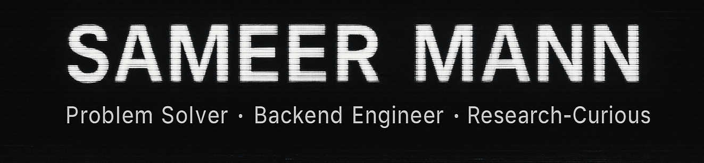
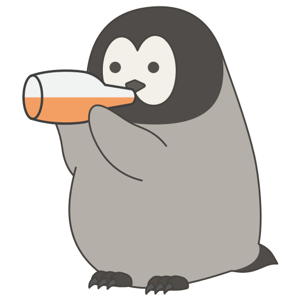

<!-- Banner -->

  

---
---

## well sum stuff about me . . .

<table>
  <tr>
    <td width="50%" valign="top">
      <h3> Curious + Chaotic</h3>
      
I take on random-some projects because I'm both curious <em>and</em> chaotic.

    </td>
    <td width="50%" valign="top">
      <h3> Problem Solver First</h3>
      
I'm a <strong>problem-solver first</strong>, code monkey second.

    </td>
  </tr>
  <tr>
    <td width="50%" valign="top">
      <h3> Runtime Fuel</h3>
      
Fueled by curiosity + caffeine + questionable Apple Music recommendations.

    </td>
    <td width="50%" valign="top">
      <h3> Stack of Choice</h3>
      
AI for quick prototypes, backend engineering for the real stuff, gaming for my sanity.

    </td>
  </tr>
</table>

---

##  Tech I Dig

<table>
  <tr>
    <td width="50%" valign="top">
      <h3> Backend Engineering</h3>
      
because I clearly am bad at frontend . . .

    </td>
    <td width="50%" valign="top">
      <h3> AI (for quick prototyping)</h3>
      
not proud of this one, will jump this ship after my college

    </td>
  </tr>
  <tr>
    <td width="50%" valign="top">
      <h3> Linux / Docker / Cloudflare Workers</h3>
      
I use arch btw (wanted to use void but just couldn't make it work)

    </td>
    <td width="50%" valign="top">
      <h3> My PC</h3>
      
(primarily gaming but let’s pretend it’s for work)

    </td>
  </tr>
</table>

---

## 🔥 Some Things I've Made

<table align="center">
  <tr>
    <td align="center" width="250">
      
       
      <strong>DreamBitTech</strong>
       
      A full-stack PC parts platform
       
      <a href="https://dreambittech.rf.gd">View →</a>
    </td>
    <td align="center" width="250">
      
       
      <strong>FactorSphere</strong>
       
      AI-powered research suite
       
      <a href="https://lander.factorsphere.org">View →</a>
    </td>
    <td align="center" width="250">
      
       
      <strong>MusiK</strong>
       
      Cross-platform music app
       
      <a href="https://github.com/REXFEDEC/musik">View →</a>
    </td>
    <td align="center" width="250">
      
       
      <strong>pd2ai</strong>
       
      PDF → OCR → AI wizardry
       
      <a href="https://pdf.goneto.space">View →</a>
    </td>
  </tr>
</table>

---

## 🔬 What’s Next?

<table>
  <tr>
    <td width="50%" valign="top">
      <h3>🧪 Research Mode</h3>
      
Focus on research

    </td>
    <td width="50%" valign="top">
      <h3>🔁 Build Loop</h3>
      
Break things, learn things, repeat

    </td>
  </tr>
  <tr>
    <td width="50%" valign="top">
      <h3>🧬 Lab Tech Energy</h3>
      
Become <em>that tech guy</em> in a biology lab running protein simulations at 3 AM

    </td>
    <td width="50%" valign="top">
      <h3>👨‍💻 Make More Pet Projects</h3>
      
Make more cool stuff that solves a problem too.

    </td>
  </tr>
</table>

---

## 🔗 Follow Me

<table>
  <tr>
    <td width="50%" valign="top">
      <h3>🌐 Portfolio</h3>
      
<a href="https://sameer.goneto.space">sameer.goneto.space</a>

    </td>
    <td width="50%" valign="top">
      <h3>💼 LinkedIn</h3>
      
<a href="https://www.linkedin.com/in/sameer-mann">/in/sameer-mann</a>

    </td>
  </tr>
  <tr>
    <td width="50%" valign="top">
      <h3>📧 Email</h3>
      
<a href="mailto:sameermann5335@gmail.com">sameermann5335@gmail.com</a>

    </td>
    <td width="50%" valign="top">
      <h3>☕ Buy Me a Coffee</h3>
      
<a href="https://buymeacoffee.com/sameermann">buymeacoffee.com/sameermann</a>

    </td>
  </tr>
</table>

---

  Built with curiosity, caffeine, and the eternal hope production doesn’t implode.

<!-- If you're reading this: you're either evaluating me or stalking. Either way: welcome. -->
